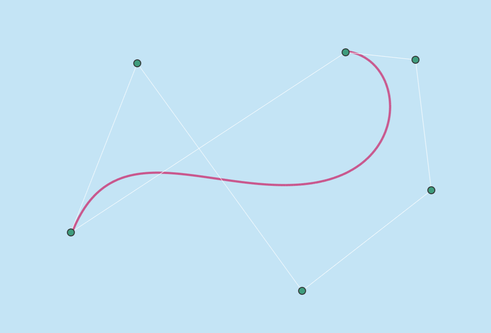

# Bezier Visualizer SFML

A small cross-platform project that allows you to create Bézier curves with any number of points  
 and modify them interactively.

## Prerequisites

- С++ (MSVC)
- CMake
- SFML

## Controls

- [Backspace] - delete the last point
- [Esc] - stop the app
- [Right mouse button] - delete the point when hovered
- [Left mouse button] - move the point when held down

